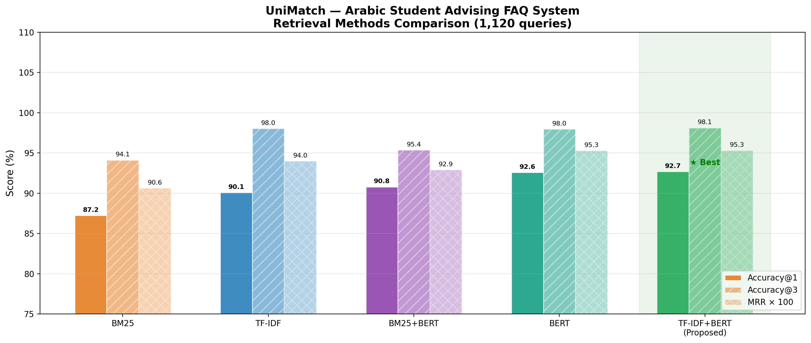

# Student Advising Chatbot — UniMatch
## نظام إرشاد الطلاب العربي

[](https://python.org)
[](https://huggingface.co)
[](https://gradio.app)
[](LICENSE)

> **Paper:** *Comparative Study of Arabic FAQ Retrieval Methods for Student Advising Systems*
> **Authors:** Areej Jaber, Palestine Technical University — Kadoorie (PTUK)

---

## Overview

**UniMatch** is an Arabic FAQ retrieval system designed for student advising at the College of Economics and Business, PTUK. It compares five retrieval methods and deploys the best-performing one as an interactive web interface.

<p align="center">
  
  <br>
  <em>Performance comparison of all five retrieval methods</em>
</p>

---

## Results

| Method | Accuracy@1 | Accuracy@3 | MRR | Time (ms) |
|--------|-----------|-----------|-----|-----------|
| BM25 | 87.23% | 94.11% | 0.9064 | **0.49** |
| TF-IDF | 90.09% | 98.04% | 0.9399 | 1.59 |
| BM25 + BERT | 90.80% | 95.36% | 0.9290 | 11.57 |
| Sentence-BERT | 92.59% | 97.95% | 0.9528 | 45.88 |
| **TF-IDF + BERT (Proposed)** | **92.68%** | **98.12%** | **0.9531** | 12.72 |

- **Index:** 280 Arabic FAQ pairs
- **Evaluation:** 1,120 queries (4 paraphrases × 280)
- **Language:** Arabic
- **Domain:** Student Advising — College of Economics, PTUK

---

## Architecture

```
Arabic Question
      ↓
Stage 1: TF-IDF (char n-grams 2-4) → top-5 candidates
      ↓
Stage 2: Sentence-BERT re-ranking (semantic similarity)
      ↓
Best Answer
```

---

## Repository Structure

```
Student-Advising-Chatbot/
│
├── notebooks/
│   ├── 01_data_preparation.ipynb          # Data loading, cleaning, stats
│   ├── 02b_method1_TFIDF.ipynb            # Method 1: TF-IDF
│   ├── 03b_method2_BERT.ipynb             # Method 2: Sentence-BERT
│   ├── 04b_method3_BM25_BERT.ipynb        # Method 3: BM25 + BERT
│   ├── 04c_method_BM25_standalone.ipynb   # Method 4: BM25
│   ├── 04d_TFIDF_BERT_Hybrid.ipynb        # Method 5: TF-IDF + BERT ★
│   ├── 05b_evaluation_final.ipynb         # Final comparison & figures
│   └── 06_web_interface.ipynb             # Gradio web interface
│
├── data/
│   └── README.md                          # How to obtain the dataset
│
├── report/
│   ├── fig1_methods_comparison.png
│   ├── fig2_response_time.png
│   ├── fig3_accuracy_vs_speed.png
│   ├── fig4_radar_chart.png
│   └── table_results.tex
│
├── requirements.txt
└── README.md
```

---

## Dataset

The dataset contains **280 Arabic FAQ pairs** from the College of Economics and Business at Palestine Technical University — Kadoorie (PTUK).

| Column | Description |
|--------|-------------|
| `question` | Original Arabic question |
| `answer` | Arabic answer |
| `question_alt` | Rephrased question (original) |
| `question_alt2` | Rephrased question (generated) |
| `question_alt3` | Rephrased question (generated) |
| `question_alt4` | Rephrased question (generated) |

> **Note:** The dataset is available upon request. Please contact the author at a.jabir@ptuk.edu.ps

---

## Installation

```bash
pip install -r requirements.txt
```

```
sentence-transformers>=2.2.2
scikit-learn>=1.3.0
pandas>=2.0.0
numpy>=1.24.0
matplotlib>=3.7.0
rank-bm25>=0.2.2
gradio>=4.0.0
torch>=2.0.0
openpyxl>=3.1.0
```

---

## Usage

### Run Notebooks in Order

```
1. 01_data_preparation.ipynb       → Clean and prepare dataset
2. 02b_method1_TFIDF.ipynb         → Evaluate TF-IDF
3. 03b_method2_BERT.ipynb          → Evaluate Sentence-BERT
4. 04c_method_BM25_standalone.ipynb → Evaluate BM25
5. 04b_method3_BM25_BERT.ipynb     → Evaluate BM25+BERT
6. 04d_TFIDF_BERT_Hybrid.ipynb     → Evaluate TF-IDF+BERT (best)
7. 05b_evaluation_final.ipynb      → Final comparison report
8. 06_web_interface.ipynb          → Launch web interface
```

### Launch Web Interface

```python
# In notebook 06 — run the last cell
# A public URL will appear:
# Running on public URL: https://xxxx.gradio.live
```

---

## Models Used

| Model | Role | Source |
|-------|------|--------|
| `paraphrase-multilingual-MiniLM-L12-v2` | Semantic embeddings | HuggingFace |
| TF-IDF (char n-grams 2-4) | Lexical retrieval | scikit-learn |
| BM25Okapi | Probabilistic retrieval | rank-bm25 |

---

## Hardware

All experiments were conducted on **Google Colab (Tesla T4 GPU)**.

---

## Citation

If you use this work, please cite:

```bibtex
@article{jaber2025unimatch,
  title   = {Comparative Study of Arabic FAQ Retrieval Methods
             for Student Advising Systems},
  author  = {Jaber, Areej},
  journal = {Under Review},
  year    = {2025},
  institution = {Palestine Technical University -- Kadoorie}
}
```

---

## Related Work

This project is related to our prior publications:

> Jaber, A., Bahati, I., & Martínez, P. (2025). *Leveraging pre-trained embeddings in an ensemble machine learning approach for Arabic sentiment analysis.* Frontiers in Artificial Intelligence, 8, 1653728.

> Duridi, T., Jaber, A., & Martínez, P. (2025). *Arabic Hate Speech Detection Based on BERT Models Variants.* Egyptian Informatics Journal, 32, 100845.

---

## Contact

**Areej Jaber**
- 📧 a.jabir@ptuk.edu.ps
- 🏛️ Computer Science Department, PTUK, Palestine
- 🔗 [GitHub](https://github.com/AreejJaber18)

---

## License

MIT License — see [LICENSE](LICENSE) for details.
